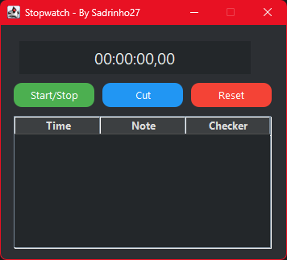

# ⏱️ Stopwatch Java App

Une application **chronomètre** développée avec **Java Swing**, simple et efficace.

## 🚀 Fonctionnalités

- Démarrer, mettre en pause et réinitialiser le chronomètre
- Interface graphique claire et réactive
- Boutons personnalisés avec design arrondi (`RoundedButton`)
- Architecture modulaire avec séparation de la logique et de l’UI

## 🛠️ Technologies utilisées

- Java SE
- Swing (pour l’interface graphique)
- Eclipse IDE

## 🧪 Lancer l'application

1. Cloner le dépôt :
   `git clone https://github.com/ton-utilisateur/stopwatch-java.git`
3. Ouvrir avec Eclipse :

   `File` > `Import` > `Existing Projects into Workspace`

4. Exécuter le fichier Main.java :

   `Clic droit` > `Run As` > `Java Application`
